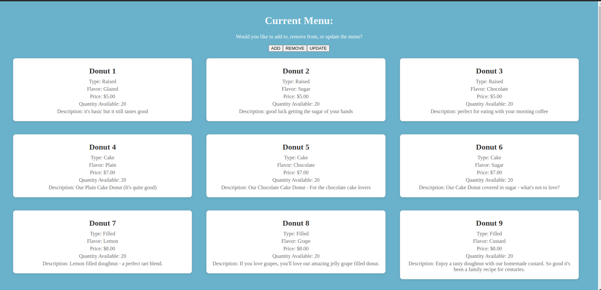

## The Donut Shop
Hello, this is a group-made donut shop webapp made for the internet and web programming class at NMT. This was designed as a project to showcase various concepts learned throughout the semester, and as such was not designed for professional use (As we would need to fix various practices - i.e using a cloud database vs. local instances of MySQL, the need for password encryption, etc.). The webapp was hosted and run on an Apache Tomcat Web Server. 

Some of the stuff I did on this project include:
*Implementing the shopping cart feature by utilizing session tracking to preserve user selections.
*Using JDBC and SQL to query a database with the available products and show product information to the user. 
*Designing the front page to show the products
*Helping coordinate team roles

And here is some examples of the webapp: 

Homepage:

Admin View to Change Current Menu:

